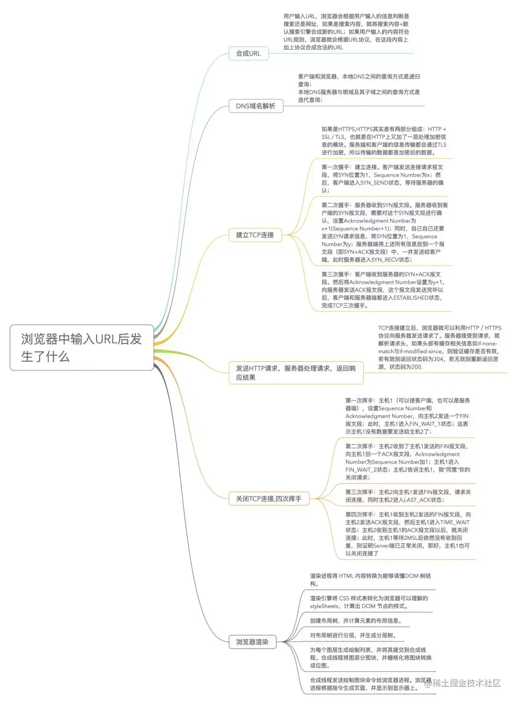

# 1. https
应对中间人攻击

对称加密内容，非对称加密 对称密钥
完整性  签名算法
证书  确保是目标服务器

# 2. http2
二进制帧，唯一帧标识
链路复用，依据帧标识重新组装
头部压缩 维护一套压缩表进行解析
服务推送
共用tcp,降低tcp慢启动影响， 有tcp头部阻塞问题

# 3. 性能优化
加载：网络 dns-prefetch  http2   资源大小：gzip, 关键可视资源  服务器：复杂逻辑
解析：html js   
运行: 梳理逻辑链路 针对性优化运行时间长的代码段

# 4. 浏览器输入url到显示
解析url
域名解析
三次握手
发起请求
读取响应
解析html-》 dom与cssom -> 渲染树 -》Layout树-》 Gpu绘制显示

